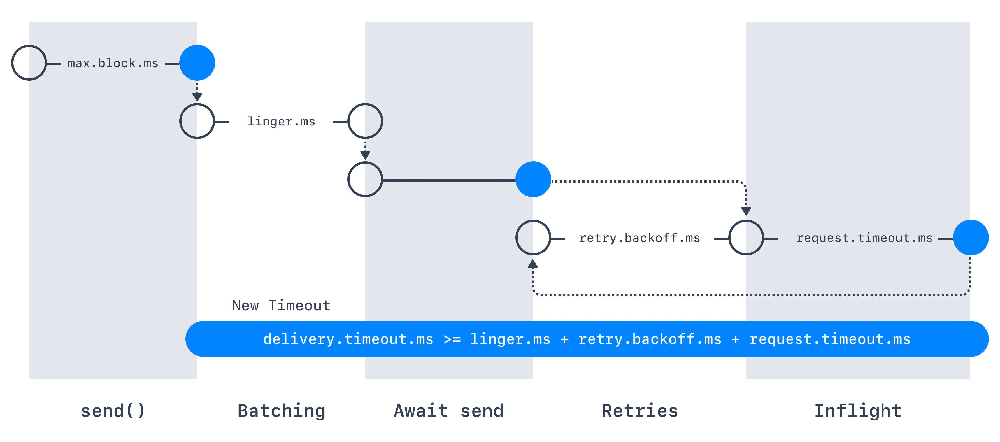

# Kafka Wikimedia Data Pipeline

This project is a hands-on guide to building a Kafka data pipeline that streams live data from Wikimedia into Apache Kafka, processes it, and sends it to OpenSearch for indexing and analysis. You'll gain practical experience with Kafka producers, consumers, and advanced Kafka features through this real-world application.

### Table of Contents

1. [Kafka Wikimedia Data Pipeline Overview](#1-kafka-wikimedia-data-pipeline-overview)
2. [Setting Up the Environment](#2-setting-up-the-environment)
   1. [Prerequisites](#21-prerequisites)
   2. [Installing Docker Compose on Debian](#22-installing-docker-compose-on-debian)
      1. [Step 1: Installing Docker Engine](#221-step-1-installing-docker-engine)
      2. [Step 2: Installing Docker Compose](#222-step-2-installing-docker-compose)
      3. [Step 3: Running Docker Compose](#223-step-3-running-docker-compose)
   3. [Running the Kafka Wikimedia Data Pipeline](#23-running-the-kafka-wikimedia-data-pipeline)
   4. [Accessing the Conduktor Platform](#24-accessing-the-conduktor-platform)
   5. [Troubleshooting](#25-troubleshooting)
3. [Implementing the Kafka Producer for Wikimedia](#3-implementing-the-kafka-producer-for-wikimedia)
   1. [Code Overview](#31-code-overview)
   2. [Explanation](#32-explanation)
      1. [Bootstrap Servers Configuration](#321-bootstrap-servers-configuration)
      2. [Wikimedia Change Handler](#322-wikimedia-change-handler)
      3. [Event Source and Stream URL](#323-event-source-and-stream-url)
      4. [Blocking the Program](#324-blocking-the-program)
   3. [Key Takeaways](#33-key-takeaways)
4. [Implementing the WikimediaChangeHandler Class](#4-implementing-the-wikimediachangehandler-class)
   1. [Code Overview](#41-code-overview)
   2. [Explanation](#42-explanation)
      1. [onMessage Method](#421-onmessage-method)
      2. [onComment Methods](#422-oncomment-methods)
   3. [Key Takeaways](#43-key-takeaways)
5. [Kafka Producer Acknowledgments](#5-kafka-producer-acknowledgments)
   1. [Overview of Acks Setting](#51-overview-of-acks-setting)
   2. [Acks Configurations](#52-acks-configurations)
6. [Kafka Topic Durability & Availability](#6-kafka-topic-durability--availability)
   1. [Durability](#61-durability)
   2. [Availability](#62-availability)
7. [Producer Retries and Idempotent Producers](#7-producer-retries-and-idempotent-producers)
   1. [Understanding Producer Retries](#71-understanding-producer-retries)
      1. [Producer Retry Configurations](#711-producer-retry-configurations)
   2. [Idempotent Producers](#72-idempotent-producers)
8. [Kafka Message Compression](#8-kafka-message-compression)
   1. [Understanding Kafka Message Compression](#81-understanding-kafka-message-compression)
      1. [Producer-Level Message Compression](#811-producer-level-message-compression)
      2. [Broker-Level Compression](#812-broker-level-compression)
9. [Kafka Producer Batching](#9-kafka-producer-batching)
   1. [Understanding Kafka Producer Batching](#91-understanding-kafka-producer-batching)
      1. [Linger Time (`linger.ms`)](#911-linger-time-linger.ms)
      2. [Batch Size (`batch.size`)](#912-batch-size-batch.size)
   2. [Key Takeaways](#92-key-takeaways)
   3. [Advantages of Batching](#93-advantages-of-batching)
10. [Kafka Producer Partitioner](#10-kafka-producer-partitioner)
    1. [Understanding Kafka Producer Partitioner](#101-understanding-kafka-producer-partitioner)
       1. [Partitioner When `key != null`](#1011-partitioner-when-key--null)
       2. [Partitioner When `key = null`](#1012-partitioner-when-key--null)
    2. [Round Robin Partitioner](#102-round-robin-partitioner)
    3. [Sticky Partitioner](#103-sticky-partitioner)
    4. [Performance Improvements with Sticky Partitioner](#1031-performance-improvements-with-sticky-partitioner)
11. [OpenSearch Consumer](#11-opensearch-consumer)
    1. [Project Setup](#111-project-setup)
    2. [Running OpenSearch with Docker](#112-running-opensearch-with-docker)
    3. [OpenSearch API Operation](#113-opensearch-api-operation)
       1. [Creating an Index](#1131-creating-an-index)
       2. [Adding Documents](#1132-adding-documents)
       3. [Retrieving Documents](#1133-retrieving-documents)
       4. [Deleting Documents](#1134-deleting-documents)
       5. [Deleting the Index](#1135-deleting-the-index)
    4. [Implementing the OpenSearch Consumer](#114-implementing-the-opensearch-consumer)
       1. [Creating the OpenSearch Client](#1141-creating-the-opensearch-client)
       2. [Checking and Creating an Index in OpenSearch](#1142-checking-and-creating-an-index-in-opensearch)
       3. [Create an Opensearch Client](#1143-create-an-opensearch-client)
       4. [Creating the Kafka Consumer](#1144-creating-the-kafka-consumer)
       5. [Checking and Creating an Index in OpenSearch](#1145-checking-and-creating-an-index-in-opensearch)
       6. [Consuming and Indexing Data](#1146-consuming-and-indexing-data)
       7. [Verifying Data Insertion in OpenSearch](#1147-verifying-data-insertion-in-opensearch)
12. [Delivery Semantics in Apache Kafka](#115-delivery-semantics-in-apache-kafka)
    1. [At-Most-Once](#1151-at-most-once)
    2. [At-Least-Once](#1152-at-least-once)
    3. [Exactly-Once](#1153-exactly-once)
    4. [Implementing Idempotent Consumers](#1154-implementing-idempotent-consumers)

## 1. Kafka Wikimedia Data Pipeline Overview

In this project, you'll build a Kafka-based data pipeline to stream, process, and analyze data from Wikimedia. The project involves using Kafka producers and consumers to handle real-time data, integrating with OpenSearch for advanced analytics.

### What You'll Learn:

- **Streaming Data**: Capture real-time data from Wikimedia and send it to Kafka topics.
- **Processing Data**: Develop consumers to process Kafka data and forward it to OpenSearch.
- **Kafka Concepts**: Understand Kafka producers, consumers, topics, partitions, and rebalancing strategies.
- **Integration with OpenSearch**: Learn how to integrate Kafka with OpenSearch for indexing and analytics.

---

## 2. Setting Up the Environment

### 2.1 Prerequisites

Before getting started, ensure you have the following installed:

- **Debian Linux**: The environment used in this guide.
- **Docker**: Containerization platform required to run Kafka, Zookeeper, and other services.
- **Docker Compose**: A tool for defining and running multi-container Docker applications.

### 2.2 Installing Docker Compose on Debian

#### 2.2.1 Step 1: Installing Docker Engine

Follow these steps to install Docker Engine:

1. **Update the package list**:

    ```bash
    sudo apt update
    ```

2. **Install dependencies**:

    ```bash
    sudo apt install apt-transport-https ca-certificates curl software-properties-common
    ```

3. **Add Docker’s official GPG key**:

    ```bash
    curl -fsSL https://download.docker.com/linux/debian/gpg | sudo gpg --dearmor -o /usr/share/keyrings/docker-archive-keyring.gpg
    ```

4. **Set up the stable repository**:

    ```bash
    echo "deb [arch=$(dpkg --print-architecture) signed-by=/usr/share/keyrings/docker-archive-keyring.gpg] https://download.docker.com/linux/debian $(lsb_release -cs) stable" | sudo tee /etc/apt/sources.list.d/docker.list > /dev/null
    ```

5. **Update the package list again**:

    ```bash
    sudo apt update
    ```

6. **Install Docker Engine**:

    ```bash
    sudo apt install docker-ce docker-ce-cli containerd.io
    ```

7. **Start and enable Docker**:

    ```bash
    sudo systemctl start docker
    sudo systemctl enable docker
    ```

#### 2.2.2 Step 2: Installing Docker Compose

With Docker Engine installed, install Docker Compose:

1. **Install Docker Compose plugin**:

    ```bash
    sudo apt install docker-compose-plugin
    ```

2. **Verify the installation**:

    ```bash
    docker compose version
    ```

#### 2.2.3 Step 3: Running Docker Compose

Run your Kafka Wikimedia Data Pipeline using Docker Compose:

1. **Navigate to your project directory**:

    ```bash
    cd ~/Documents/projects/kafka-wikimedia-data-pipeline/conduktor-platform
    ```

2. **Start the Docker services**:

    ```bash
    sudo docker compose up -d
    ```

### 2.3 Running the Kafka Wikimedia Data Pipeline

After installing Docker Compose, you can now run the Kafka Wikimedia Data Pipeline. This will start Zookeeper, Kafka, Schema Registry, and the Conduktor platform.

### 2.4 Accessing the Conduktor Platform

Once the containers are up and running, access Conduktor:

1. **Open your browser** and go to:

    ```
    http://localhost:8080
    ```

2. **Login using the credentials** specified in `platform-config.yml`:

   - **Email:** `admin@conduktor.io`
   - **Password:** `admin`

3. **Explore the Conduktor Platform**:
   - Manage your Kafka cluster, monitor streams, and utilize the full feature set of Conduktor.


### Troubleshooting

If you encounter an error when trying to access Kafka or its services, and you receive the following message:

```plaintext
The server is unreachable. Make sure the host is correct and retry.
```

This issue may occur if the Kafka broker service is not properly reachable by other containers or services within the Docker network.

#### Solution:

1. **Restart the Kafka Docker Container**:

   This error can typically be resolved by restarting the Kafka service to re-establish the necessary network connections.

   To restart the Kafka container, run the following command:

   ```bash
   sudo docker restart kafka
   ```
---

## 3. Implementing the Kafka Producer for Wikimedia

### 3.1 Code Overview

Below is the code for the `WikimediaChangesProducer` class. This Java class sets up a Kafka producer that streams real-time data from Wikimedia's event stream and sends it to a Kafka topic.

```java
package org.example.kafka.wikimedia;

import com.launchdarkly.eventsource.EventHandler;
import com.launchdarkly.eventsource.EventSource;
import org.apache.kafka.clients.producer.KafkaProducer;
import org.apache.kafka.clients.producer.ProducerConfig;
import org.apache.kafka.common.serialization.StringSerializer;

import java.net.URI;
import java.util.Properties;
import java.util.concurrent.TimeUnit;

public class WikimediaChangesProducer {

   public static void main(String[] args) throws InterruptedException {

      String bootstrapServers = "127.0.0.1:9092";

      // create Producer Properties
      Properties properties = new Properties();
      properties.setProperty(ProducerConfig.BOOTSTRAP_SERVERS_CONFIG, bootstrapServers);
      properties.setProperty(ProducerConfig.KEY_SERIALIZER_CLASS_CONFIG, StringSerializer.class.getName());
      properties.setProperty(ProducerConfig.VALUE_SERIALIZER_CLASS_CONFIG, StringSerializer.class.getName());

      // create the Producer
      KafkaProducer<String, String> producer = new KafkaProducer<>(properties);

      String topic = "wikimedia.recentchange";

      EventHandler eventHandler = new WikimediaChangeHandler(producer, topic);
      String url = "https://stream.wikimedia.org/v2/stream/recentchange";
      EventSource.Builder builder = new EventSource.Builder(eventHandler, URI.create(url));
      EventSource eventSource = builder.build();

      // start the producer in another thread
      eventSource.start();

      // we produce for 10 minutes and block the program until then
      TimeUnit.MINUTES.sleep(10);
   }
}
```

### 3.2 Explanation

#### 1. **Bootstrap Servers Configuration**
   ```java
   String bootstrapServers = "127.0.0.1:9092";
   ```
- **Bootstrap servers** are the addresses of the Kafka brokers that the producer will connect to. In this example, Kafka is running on `localhost` with the default port `9092`.

#### 2. **Wikimedia Change Handler**
   ```java
   EventHandler eventHandler = new WikimediaChangeHandler(producer, topic);
   ```
- The `WikimediaChangeHandler` class is implemented to handle the events received from the Wikimedia stream. It processes these events and sends them to the specified Kafka topic using the producer.

#### 3. **Event Source and Stream URL**
   ```java
   String url = "https://stream.wikimedia.org/v2/stream/recentchange";
   EventSource.Builder builder = new EventSource.Builder(eventHandler, URI.create(url));
   Event

Source eventSource = builder.build();
   ```
- **URL**: The `url` specifies the Wikimedia stream endpoint. The producer listens to this endpoint to capture real-time events.
- **EventSource**: The `EventSource` class manages the connection to the Wikimedia stream and forwards the received events to the `WikimediaChangeHandler`.

#### 4. **Blocking the Program**
   ```java
   TimeUnit.MINUTES.sleep(10);
   ```
- This line ensures that the producer keeps running for 10 minutes, during which it continuously processes and sends events to Kafka. After 10 minutes, the program will exit, and the producer will stop.

### 3.3 Key Takeaways

- **Event Streaming**: The producer continuously streams real-time events from Wikimedia, demonstrating how Kafka can be used to handle live data feeds.
- **Event Handling**: The `WikimediaChangeHandler` plays a crucial role in processing the incoming events and ensuring they are correctly forwarded to Kafka.
- **Multi-Threading**: The producer operates in its thread, allowing the program to handle the events asynchronously without blocking the main execution flow.

---

## 4. Implementing the WikimediaChangeHandler 

### 4.1 Code Overview

Below is the code for the `WikimediaChangeHandler` . This class is responsible for handling the events received from the Wikimedia event stream and sending them to the Kafka topic.

```java
package org.example.kafka.wikimedia;

import com.launchdarkly.eventsource.EventHandler;
import com.launchdarkly.eventsource.MessageEvent;
import org.apache.kafka.clients.producer.KafkaProducer;
import org.apache.kafka.clients.producer.ProducerRecord;
import org.slf4j.Logger;
import org.slf4j.LoggerFactory;

public class WikimediaChangeHandler implements EventHandler {

    KafkaProducer<String, String> kafkaProducer;
    String topic;
    private final Logger log = LoggerFactory.getLogger(WikimediaChangeHandler.class.getSimpleName());

    public WikimediaChangeHandler(KafkaProducer<String, String> kafkaProducer, String topic){
        this.kafkaProducer = kafkaProducer;
        this.topic = topic;
    }

    @Override
    public void onOpen() {
        // nothing here
    }

    @Override
    public void onClosed() {
        kafkaProducer.close();
    }

    @Override
    public void onMessage(String event, MessageEvent messageEvent) {
        log.info(messageEvent.getData());
        // asynchronous
        kafkaProducer.send(new ProducerRecord<>(topic, messageEvent.getData()));
    }

    @Override
    public void onComment(String comment) {
        // nothing here
    }

    @Override
    public void onError(Throwable t) {
        log.error("Error in Stream Reading", t);
    }
}
```

### 4.2 Explanation

#### 1. **onMessage Method**
   ```java
   @Override
   public void onMessage(String event, MessageEvent messageEvent) {
       log.info(messageEvent.getData());
       // asynchronous
       kafkaProducer.send(new ProducerRecord<>(topic, messageEvent.getData()));
   }
   ```
- **onMessage**: This method handles incoming messages from the Wikimedia event stream. The message data is logged and then asynchronously sent to the Kafka topic using the producer.

#### 2. **onComment Methods**
   ```java
   @Override
   public void onError(Throwable t) {
       log.error("Error in Stream Reading", t);
   }
   ```
- **onError**: This method is triggered when there’s an error in reading the stream. The error is logged for debugging purposes.

### 4.3 Key Takeaways

- **Event Handling**: The `WikimediaChangeHandler` class is crucial for processing and forwarding events from the Wikimedia stream to Kafka.
- **Error Handling**: Proper logging is implemented to track errors during the event streaming process.
- **Resource Management**: Ensures that the Kafka producer is properly closed when the stream is closed, preventing resource leaks.
---

## 5. Kafka Producer Acknowledgments

### 5.1 Overview of Acks Setting

Kafka producers write data to the current leader broker for a partition. To ensure the message is considered successfully written, producers must specify an acknowledgment level (`acks`). This determines whether the message must be written to a minimum number of replicas before being confirmed.

The `acks` setting has a default value that varies based on the Kafka version:

- **Kafka < v3.0**: Default is `acks=1`.
- **Kafka >= v3.0**: Default is `acks=all`.

### 5.2 Acks Configurations

1. **acks=0**:
   
   - The producer considers the message as successfully sent once it is dispatched, without waiting for any broker acknowledgment.
   - **Use Case**: Scenarios where losing some messages is acceptable, such as metrics collection. This setting provides the highest throughput as it minimizes network overhead.

2. **acks=1**:
   
   - The producer considers the message as successfully written when the leader broker acknowledges it.
   - **Use Case**: Standard operations where losing data is not critical but replication is not guaranteed. If the leader fails before the replicas replicate the data, data loss may occur.

3. **acks=all or -1**:
   
   - The producer considers the message as successfully written when all in-sync replicas (ISR) have acknowledged it.
   - **Use Case**: Scenarios requiring high data integrity. This setting ensures that the message is replicated across all in-sync replicas before being acknowledged. The broker setting `min.insync.replicas` controls the minimum number of replicas that must acknowledge the message.
     
   
   The `min.insync.replicas` can be configured at both the topic and broker levels. If the number of available replicas falls below this value, the broker will reject the write request, ensuring no data is lost even in the event of broker failures.
---

## 6. Kafka Topic Durability & Availability

### 6.1 Durability

For a topic with a replication factor of 3, topic data durability can withstand the loss of up to 2 brokers. As a general rule, with a replication factor of N, you can permanently lose up to N-1 brokers and still recover your data.

### 6.2 Availability

Availability depends on both the replication factor and the acknowledgment settings of the producer. To illustrate, consider a replication factor of 3:

- **Reads**: As long as one partition is up and considered an ISR (In-Sync Replica), the topic will be available for reads.

- **Writes**:
   - **acks=0 & acks=1**: As long as one partition is up and considered an ISR, the topic will be available for writes.
   - **acks=all**:
      - **min.insync.replicas=1 (default)**: The topic must have at least 1 ISR partition up (including the leader), allowing for two brokers to be down.
      - **min.insync.replicas=2**: The topic must have at least 2 ISR partitions up, so with a replication factor of 3, only one broker can be down. This guarantees that every write is replicated at least twice.
      - **min.insync.replicas=3**: This setting would not be practical for a replication factor of 3, as it would not tolerate any broker failures.

In summary, when `acks=all` with `replication.factor=N` and `min.insync.replicas=M`, you can tolerate N-M brokers going down while maintaining topic availability.

- **Note**:
The most popular combination for ensuring both data durability and availability is setting acks=all and min.insync.replicas=2 with a replication factor of 3. This configuration allows you to withstand the loss of one Kafka broker while maintaining good data durability and availability.
---

## 7. Producer Retries and Idempotent Producers

### 7.1 Understanding Producer Retries

When a Kafka producer sends messages to a broker, the broker can return either a success or an error code. These error codes fall into two categories:

- **Retriable Errors**: Errors that can be resolved by retrying the message. For example, if the broker returns a `NotEnoughReplicasException`, the producer can attempt to resend the message, as the replica brokers might come back online and the second attempt might succeed.

- **Non-Retriable Errors**: Errors that cannot be resolved by retrying. For example, if the broker returns an `INVALID_CONFIG` exception, retrying the same request will not change the outcome.

To ensure that no messages are dropped when sent to Kafka, it is advisable to enable retries. However, retries should be configured carefully to ensure message ordering and delivery guarantees.

#### 7.1.1 Producer Retry Configurations

```java
// create safe Producer
properties.setProperty(ProducerConfig.ENABLE_IDEMPOTENCE_CONFIG, "true");
properties.setProperty(ProducerConfig.ACKS_CONFIG, "all");
properties.setProperty(ProducerConfig.RETRIES_CONFIG, Integer.toString(Integer.MAX_VALUE));
properties.setProperty(ProducerConfig.MAX_IN_FLIGHT_REQUESTS_PER_CONNECTION, "5"); // Keep as 5 for Kafka 2.0 >= 1.1, use 1 otherwise.
```

1. **`retries`**:
   - This setting determines how many times the producer will attempt to send a message before marking it as failed.
   - **Default Values**:
      - `0` for Kafka ≤ 2.0
      - `MAX_INT` (2147483647) for Kafka ≥ 2.1
   - It's generally recommended to leave this configuration unset and use `delivery.timeout.ms` to control retry behavior.

2. **`delivery.timeout.ms`**:
   - If `retries > 0`, for example, `retries = 2147483647`, the producer won't retry forever; it is bounded by a timeout.
   - **Recommended Value**: `delivery.timeout.ms=120000` (2 minutes).
   - This ensures that records will fail if they can't be delivered within the specified timeout.

3. **`retry.backoff.ms`**:
   - This configuration controls how long the producer waits between retries.
   - **Default Value**: 100ms.

4. **`max.in.flight.requests.per.connection`**:
   - Allowing retries without setting `max.in.flight.requests.per.connection` to 1 can potentially change the order of records.
   - **Recommendation**: Set this to `1` if you rely on key-based ordering to guarantee that Kafka preserves message order even if retries are required.

The diagram below illustrates the Kafka producer retry process:



This diagram helps visualize the retry process and how various configurations interact:

- **Send**: The producer attempts to send a message.
- **Batching**: The message is batched according to the `linger.ms` setting.
- **Await Send**: The message awaits send confirmation.
- **Retries**: If an error occurs, the producer waits for `retry.backoff.ms` and retries sending the message.
- **Inflight**: Messages are in transit and the total time is controlled by `request.timeout.ms`.

Finally, the `delivery.timeout.ms` is an overarching timeout ensuring that the total time spent in retries, batching, and inflight does not exceed this value.

## 7.2 Idempotent Producers

When a producer sends a message to Kafka, there could be network errors that cause duplicate messages. Kafka introduced idempotent producers to handle such scenarios:

- **Idempotent Producer**: This ensures that even if the producer retries sending a message due to network issues, Kafka will recognize the duplicate and prevent it from being committed multiple times.

With Kafka 3.0 and later, the following defaults ensure a safe and reliable producer configuration:

- `acks = all`
- `enable.idempotence = true`
- `retries = MAX_INT`
- `max.in.flight.requests.per.connection = 5` (for Kafka >= 2.0) or `1` (for older versions).

These settings help maintain message order, ensure data integrity, and prevent duplicates.

In summary, for Kafka 3.0 and later, the producer is safe by default, and you do not need to make any changes. For earlier versions, it is recommended to manually set the configurations to ensure the reliability of your data pipeline.

---

# 8. Kafka Message Compression

## 8.1 Understanding Kafka Message Compression

When sending data to Kafka, producers often handle text-based data formats such as JSON, which can be quite large. To optimize performance, it’s crucial to apply compression at the producer level. By default, Kafka producer messages are sent uncompressed, which can lead to inefficiencies in both network utilization and storage.

Kafka supports two types of message compression: producer-side compression and broker-side compression. Each method has its benefits and specific use cases.

### 8.1.1 Producer-Level Message Compression

Producers can choose to compress messages before sending them to Kafka by configuring the `compression.type` setting. This setting has several options:

- **none**: No compression is applied (this is the default setting).
- **gzip**: Standard gzip compression.
- **lz4**: LZ4 compression, optimized for speed.
- **snappy**: Snappy compression, offering a good balance between speed and compression ratio.
- **zstd**: Zstandard compression, available in Kafka 2.1 and later, provides better compression ratios at a similar or faster speed compared to gzip.

When enabled, compression happens at the batch level, meaning all messages in a single producer batch are compressed together. This approach increases the efficiency of compression, particularly when dealing with large batches, and can significantly reduce the size of the messages being sent to Kafka.

**Advantages of Producer-Level Compression**:

- **Reduced Network Utilization**: Compressed messages are smaller, which reduces the amount of data sent over the network, leading to less latency and better throughput.
- **Improved Disk Utilization**: Smaller message sizes mean that Kafka can store more data on disk, which is particularly beneficial when dealing with large volumes of data.

**Trade-offs**:

- **Increased CPU Usage**: Both the producer and consumer must commit additional CPU resources to compress and decompress the messages. However, this overhead is often minimal compared to the benefits gained in network and storage efficiency.

### 8.1.2 Broker-Level Compression

Compression can also be configured at the broker or topic level. This setting allows Kafka to handle compression based on the `compression.type` defined for a specific topic.

- **`compression.type=producer`**: The broker takes the compressed batch from the producer and writes it directly to the topic’s log file without recompressing the data. This is the default setting and is optimal because it avoids unnecessary recompression.

- **Topic-Specific Compression**: If a topic is configured with a specific compression type (e.g., `lz4`), and this type matches the producer's compression setting, the broker will write the messages as they are. However, if the producer uses a different compression method, the broker will decompress the messages and then recompress them according to the topic's specified compression type.

**Advantages of Broker-Level Compression**:

- **Flexibility**: It allows central control over compression settings at the topic level, useful when you don’t have control over the producer’s settings or when you want uniform compression across all messages in a topic.

- **Trade-offs**: Similar to producer-level compression, broker-side compression consumes additional CPU cycles, particularly if the broker has to decompress and recompress messages.

---

**Best Practices for Kafka Message Compression**:

1. **Enable Compression in Production**: Always use compression in production environments, especially when dealing with high-throughput streams, to optimize network and storage efficiency.

2. **Optimize for Speed and Compression Ratio**: Consider using `snappy` or `lz4` for an optimal balance between speed and compression efficiency.

3. **Batch Size and Linger Time**: Adjusting the `batch.size` and `linger.ms` settings can help create larger batches of messages, which improves the efficiency of compression.

4. **Testing Compression Settings**: Always test different compression settings in your environment before applying them to production to ensure they meet your performance requirements.

---

# 9. Kafka Producer Batching

## 9.1 Understanding Kafka Producer Batching

Kafka producers, by default, attempt to send records as soon as possible. However, to optimize performance and resource utilization, Kafka introduces the concept of message batching. This feature is controlled by two main settings: `linger.ms` and `batch.size`.

### 9.1.1 Linger Time (`linger.ms`)

The `linger.ms` setting controls how long the producer is willing to wait before sending a batch of messages. By default, this value is set to `0`, meaning the producer will send messages immediately. However, introducing a small delay by setting `linger.ms` to a value such as `20ms` can significantly improve throughput and compression efficiency.

- **How It Works**: If `linger.ms` is greater than `0`, the producer waits for the specified time before sending the batch, allowing more messages to accumulate and be sent together.
- **Benefits**: This delay increases the chances of messages being batched together, which improves network and disk efficiency due to higher compression ratios and fewer network trips.

### 9.1.2 Batch Size (`batch.size`)

The `batch.size` setting determines the maximum number of bytes that can be included in a batch. The default value is `16KB`, but increasing this size to `32KB` or `64KB` can further improve compression and throughput.

- **How It Works**: If a batch reaches its `batch.size` before the `linger.ms` period ends, the producer sends the batch immediately.
- **Considerations**: Each partition has its own batch, so setting `batch.size` too high may lead to excessive memory usage. It’s crucial to monitor the average batch size using Kafka producer metrics to avoid performance issues.

---
**Key Takeaways**:

- **Increase `linger.ms`**: This allows the producer to wait a few milliseconds before sending batches, improving throughput and compression.
- **Increase `batch.size`**: If your producer is sending full batches and you have available memory, consider increasing the batch size to improve efficiency.

A high-throughput Kafka producer might be configured as follows:

```java
// High throughput producer (at the expense of some latency and CPU usage)
properties.setProperty(ProducerConfig.COMPRESSION_TYPE_CONFIG, "snappy");
properties.setProperty(ProducerConfig.LINGER_MS_CONFIG, "20");
properties.setProperty(ProducerConfig.BATCH_SIZE_CONFIG, Integer.toString(32 * 1024)); // 32KB
```

## 9.3 Advantages of Batching

- **Higher Compression Ratios**: Batching messages together increases the effectiveness of compression, reducing the size of data sent over the network and stored on disk.
- **Improved Network Efficiency**: Larger batches reduce the number of network trips, decreasing latency and increasing throughput.
- **Better Disk Utilization**: Compressed batches use less disk space, allowing Kafka to store more data.

---

# 10. Kafka Producer Partitioner

## 10.1 Understanding Kafka Producer Partitioner

A partitioner in Kafka is responsible for determining which partition a specific message will be assigned to. Kafka producers use a partitioning logic to distribute messages across the available partitions of a topic. The choice of partitioning logic can significantly impact the performance and efficiency of message distribution, especially under high throughput conditions.

### 10.1.1 Partitioner When `key != null`

When a key is provided for a message, Kafka uses a hashing algorithm to determine the partition. In the default Kafka partitioner, the keys are hashed using the **murmur2** algorithm:

```java
targetPartition = Math.abs(Utils.murmur2(keyBytes)) % (numPartitions - 1)
```

- **How It Works**: The same key will always map to the same partition because the murmur2 algorithm is deterministic. This ensures that all messages with the same key are routed to the same partition.
- **Impact of Adding Partitions**: If you increase the number of partitions for a topic, the partition assignment formula is altered, which can disrupt the key-based message ordering. Therefore, it's generally recommended to avoid adding partitions to an existing topic if key-based ordering is critical.

### 10.1.2 Partitioner When `key = null`

When no key is provided, the Kafka producer uses a default partitioning strategy. The strategy used depends on the Kafka version:

- **Round Robin Partitioner (Kafka ≤ 2.3)**: Messages are distributed evenly across all partitions in a round-robin fashion. This results in smaller batches for each partition, leading to higher latency due to more network requests and smaller batch sizes.
- **Sticky Partitioner (Kafka ≥ 2.4)**: To improve performance, Kafka 2.4 introduced the sticky partitioner. This partitioner "sticks" to a partition until the current batch is full or the `linger.ms` time has elapsed, then it moves on to the next partition. This results in larger batches and reduced latency.

## 10.2 Round Robin Partitioner

For Kafka versions 2.3 and below, the default partitioner sends messages to partitions in a round-robin fashion:

- **Behavior**: The producer sends the first message to partition 1, the second message to partition 2, and so on, cycling through the available partitions.
- **Challenges**: This can lead to inefficient batching because each partition may end up with smaller batches, especially when dealing with a large number of partitions. Smaller batches result in more frequent requests and higher latency.

## 10.3 Sticky Partitioner

Starting with Kafka 2.4, the sticky partitioner became the default strategy:

- **Behavior**: The sticky partitioner sends all messages in a batch to the same partition. Once the batch is full or the `linger.ms` time expires, the producer switches to another partition.
- **Advantages**:
   - **Larger Batches**: Since all messages in a batch go to the same partition, the batch size is likely to be larger, which reduces the number of network requests.
   - **Reduced Latency**: Larger batches mean fewer requests, which in turn reduces latency.
   - **Balanced Distribution**: Over time, messages are still evenly distributed across partitions, ensuring the cluster remains balanced.

### 10.3.1 Performance Improvements with Sticky Partitioner

The introduction of the sticky partitioner leads to noticeable performance improvements, particularly in high-throughput environments:

- **Reduced Latency**: The sticky partitioner significantly lowers latency compared to the round-robin approach, especially as the number of partitions increases.
- **Scalability**: The sticky partitioner is more scalable, allowing Kafka to handle a larger number of partitions with better performance.

---

# 11. OpenSearch Consumer

In this section, we're going to set up a Kafka consumer that integrates with OpenSearch, enabling data indexing and search capabilities. Here's how to get it up and running:

## 11.1 Project Setup

1. **Create a new module**: `KafkaConsumerOpenSearch`.
2. **Add dependencies**:
   - Kafka clients
   - OpenSearch REST High-Level Client
   - GSON for JSON processing

## 11.2 Running OpenSearch with Docker

For those using Docker:
- Navigate to your project directory and start your services:
  ```bash
  cd ~/Documents/projects/kafka-wikimedia-data-pipeline/kafka-consumer-opensearch
  sudo docker compose up -d
  ```
- Verify OpenSearch is running by navigating to `http://localhost:9200/`.

## 11.3 Opensearch API Operation

- Open `http://localhost:5601/app/dev_tools#/console`.
- Use the console to run commands against your OpenSearch instance:
  ```
  GET /
  ```

and you will get this response: 
  ```
{
  "name" : "9d6ad5027a1d",
  "cluster_name" : "docker-cluster",
  "cluster_uuid" : "yyzuxaXeQQqdVsqvuzaiEQ",
  "version" : {
    "number" : "7.10.2",
    "build_type" : "tar",
    "build_hash" : "e505b10357c03ae8d26d675172402f2f2144ef0f",
    "build_date" : "2022-01-14T03:38:06.881862Z",
    "build_snapshot" : false,
    "lucene_version" : "8.10.1",
    "minimum_wire_compatibility_version" : "6.8.0",
    "minimum_index_compatibility_version" : "6.0.0-beta1"
  },
  "tagline" : "The OpenSearch Project: https://opensearch.org/"
}
  ```

### 11.3.1 Creating an Index

To create an index in OpenSearch, which is necessary for storing data, execute the following command:

```http
PUT /my-first-index
```

You should receive a response like this:

```json
{
  "acknowledged": true,
  "shards_acknowledged": true,
  "index": "my-first-index"
}
```

### 11.3.2 Adding Documents

Add documents to your index by specifying a unique ID for each document:

```http
PUT /my-first-index/_doc/1
{
  "Description": "The past resembles the future more than one drop of water resembles another."
}
```

Successful document addition will return:

```json
{
  "_index": "my-first-index",
  "_type": "_doc",
  "_id": "1",
  "_version": 1,
  "result": "created",
  "_shards": {
    "total": 2,
    "successful": 1,
    "failed": 0
  },
  "_seq_no": 0,
  "_primary_term": 1
}
```

### 11.3.3 Retrieving Documents

Retrieve the document with ID 1 from your index:

```http
GET /my-first-index/_doc/1
```

This will show the document details:

```json
{
  "_index": "my-first-index",
  "_type": "_doc",
  "_id": "1",
  "_version": 1,
  "_seq_no": 0,
  "_primary_term": 1,
  "found": true,
  "_source": {
    "Description": "To be or not to be, that is the question."
  }
}
```

### 11.3.4 Deleting Documents

To remove a specific document from the index:

```http
DELETE /my-first-index/_doc/1
```

Confirmation of document deletion:

```json
{
  "_index": "my-first-index",
  "_type": "_doc",
  "_id": "1",
  "_version": 2,
  "result": "deleted",
  "_shards": {
    "total": 2,
    "successful": 1,
    "failed": 0
  },
  "_seq_no": 1,
  "_primary_term": 1
}
```

### 11.3.5 Deleting the Index

Finally, to completely remove the index:

```http
DELETE /my-first-index
```

You'll receive an acknowledgment:

```json
{
  "acknowledged": true
}
```
Here's a structured and detailed new section to add to your README, focusing on implementing the OpenSearch Consumer within your Kafka Wikimedia Data Pipeline. This section incorporates the provided script and explanation:

## 11.4 Implementing the OpenSearch Consumer

In this section, we will guide you through the process of setting up and implementing the OpenSearch Consumer which connects to your Kafka data pipeline. The OpenSearch Consumer is responsible for indexing and searching the data streamed from Wikimedia.

### 11.4.1 Creating the OpenSearch Client

Before integrating Kafka with OpenSearch, it's essential to establish a connection with the OpenSearch server. We start by creating an OpenSearch Client using the `RestHighLevelClient`. This client will handle all communications between our Java application and the OpenSearch server.

#### Code Snippet for OpenSearch Client Creation:

```java
public static RestHighLevelClient createOpenSearchClient() {
    String connectionString = "http://localhost:9200"; // Local OpenSearch instance
    URI connUri = URI.create(connectionString);
    String userInfo = connUri.getUserInfo();

    if (userInfo == null) {
        return new RestHighLevelClient(
                RestClient.builder(new HttpHost(connUri.getHost(), connUri.getPort(), "http")));
    } else {
        String[] auth = userInfo.split(":");
        CredentialsProvider credentialsProvider = new BasicCredentialsProvider();
        credentialsProvider.setCredentials(AuthScope.ANY, 
            new UsernamePasswordCredentials(auth[0], auth[1]));

        return new RestHighLevelClient(
                RestClient.builder(new HttpHost(connUri.getHost(), connUri.getPort(), connUri.getScheme()))
                        .setHttpClientConfigCallback(httpAsyncClientBuilder -> 
                            httpAsyncClientBuilder.setDefaultCredentialsProvider(credentialsProvider)
                                    .setKeepAliveStrategy(new DefaultConnectionKeepAliveStrategy())));
    }
}
```


### 11.4.2 Creating the Kafka Consumer

The Kafka Consumer is configured to subscribe to the `wikimedia.recentchange` topic and read records. Here's how you can set it up:

```java
private static KafkaConsumer<String, String> createKafkaConsumer() {
    Properties properties = new Properties();
    properties.setProperty(CommonClientConfigs.BOOTSTRAP_SERVERS_CONFIG, "127.0.0.1:9092");
    properties.setProperty(ConsumerConfig.KEY_DESERIALIZER_CLASS_CONFIG, StringDeserializer.class.getName());
    properties.setProperty(ConsumerConfig.VALUE_DESERIALIZER_CLASS_CONFIG, StringDeserializer.class.getName());
    properties.setProperty(ConsumerConfig.GROUP_ID_CONFIG, "consumer-opensearch-demo");
    properties.setProperty(ConsumerConfig.AUTO_OFFSET_RESET_CONFIG, "latest");
    return new KafkaConsumer<>(properties);
}
```

### 11.4.3 Checking and Creating an Index in OpenSearch

Before data ingestion, ensure the OpenSearch index exists, or create it if it doesn't:

```java
boolean indexExists = openSearchClient.indices().exists(new GetIndexRequest("wikimedia"), RequestOptions.DEFAULT);
if (!indexExists) {
    CreateIndexRequest createIndexRequest = new CreateIndexRequest("wikimedia");
    openSearchClient.indices().create(createIndexRequest, RequestOptions.DEFAULT);
    log.info("The Wikimedia Index has been created!");
} else {
    log.info("The Wikimedia Index already exists.");
}
```

### 11.4.4 Consuming and Indexing Data

After setting up the client and ensuring the index exists, the consumer reads data from Kafka and indexes it into OpenSearch:

```java
while (true) {
    ConsumerRecords<String, String> records = consumer.poll(Duration.ofMillis(3000));
    for (ConsumerRecord<String, String> record : records) {
        IndexRequest indexRequest = new IndexRequest("wikimedia")
                .source(record.value(), XContentType.JSON);
        IndexResponse response = openSearchClient.index(indexRequest, RequestOptions.DEFAULT);
        log.info("Document indexed with ID: " + response.getId());
    }
}
```


### 11.4.5 Verifying Data Insertion in OpenSearch

Once data is indexed in OpenSearch, you can verify the document by querying it directly in the OpenSearch Dashboard. To trace the data, check for the document ID logged in your IntelliJ terminal, which will look similar to this:

```
[main] INFO OpenSearchConsumer - YqZ9epEBghSTW3VMMiZP
```

**Steps to verify the data:**

1. **Access the OpenSearch Dashboard**:
   - Open your browser and navigate to:
     ```
     http://localhost:5601/app/dev_tools#/console
     ```

2. **Query the Document**:
   - Use the OpenSearch Dev Tools to execute the following query:
     ```http
     GET /wikimedia/_doc/YqZ9epEBghSTW3VMMiZP
     ```
   - Replace `YqZ9epEBghSTW3VMMiZP` with the actual ID logged in the terminal after indexing the document.

3. **View the Document**:
   - The response will display the JSON document that was sent from Apache Kafka to OpenSearch, confirming successful indexing:
   - The `_source` field contains the actual data that was indexed in OpenSearch, verifying that the data stream from Kafka was successfully captured and stored.

---

## 11.5 Delivery Semantics in Apache Kafka

Apache Kafka supports three types of delivery semantics that dictate how reliably messages are delivered:

1. **At-Most-Once**
   - Messages are delivered at most once, meaning they may be lost but won't be delivered twice. This happens when offsets are committed as soon as a batch of messages is received, regardless of whether they have been processed or not. If a consumer fails after committing its offset but before processing all messages, some messages may not be processed at all.

2. **At-Least-Once (Preferred)**
   - Messages are delivered at least once, meaning they may be delivered more than once if a consumer retries after a failure. This requires processing to be idempotent because the same message could be processed multiple times. Messages are committed only after they are processed, ensuring no data loss but potentially leading to duplicate processing.

3. **Exactly-Once**
   - Messages are delivered exactly once, which is the most desirable but the most challenging to achieve. This is typically only possible when both the producer and consumer are fully controlled and able to participate in a coordinated transaction. Kafka's transactional APIs, especially with Kafka Streams, facilitate exactly-once semantics by ensuring that messages are neither lost nor seen more than once.

### 11.5.1 Implementing Idempotent Consumers with OpenSearch

When integrating Kafka with external systems like OpenSearch, ensuring idempotent processing is crucial. This prevents duplicate entries when messages are reprocessed after a consumer failure. Below are two strategies for achieving idempotence in OpenSearch consumers:

#### Strategy 1: Kafka Record Coordinates
- Use Kafka's inherent coordinates (topic, partition, and offset) as a unique identifier to prevent duplicates:
  ```java
  String id = record.topic() + "_" + record.partition() + "_" + record.offset();
  ```

#### Strategy 2: Extracting ID from Message Content
- Preferably, extract a unique identifier from the message content if available. This approach ties the idempotence to the data itself, which is more natural and reliable:
  ```java
  private static String extractId(String json) {
      return JsonParser.parseString(json)
             .getAsJsonObject()
             .get("meta")
             .getAsJsonObject()
             .get("id")
             .getAsString();
  }
  ```

### Implementation Example

Here's how you can implement an OpenSearch consumer that uses the second strategy to ensure idempotent processing:

```java
    public static void main(String[] args) throws IOException {

        Logger log = LoggerFactory.getLogger(OpenSearchConsumer.class.getSimpleName());

        // first create an OpenSearch Client
        RestHighLevelClient openSearchClient = createOpenSearchClient();

        // create our Kafka Client
        KafkaConsumer<String, String> consumer = createKafkaConsumer();


        // we need to create the index on OpenSearch if it doesn't exist already

        try (openSearchClient; consumer) {

           boolean indexExists = openSearchClient.indices().exists(new GetIndexRequest("wikimedia"), RequestOptions.DEFAULT);
   
           if (!indexExists) {
              CreateIndexRequest createIndexRequest = new CreateIndexRequest("wikimedia");
              openSearchClient.indices().create(createIndexRequest, RequestOptions.DEFAULT);
              log.info("The Wikimedia Index has been created!");
              } else {
              log.info("The Wikimedia Index already exits");
           }
   
           // we subscribe the consumer
           consumer.subscribe(Collections.singleton("wikimedia.recentchange"));
   
              while (true) {
      
                 ConsumerRecords<String, String> records = consumer.poll(Duration.ofMillis(3000));
         
                 int recordCount = records.count();
                 log.info("Received " + recordCount + " record(s)");
         
         
                 for (ConsumerRecord<String, String> record : records) {
         
                    // send the record into OpenSearch
            
                    /*//strategy 1 : define an ID using kafka Record coordinates
                    String id = record.topic() + "_" + record.partition() + "_" + record.offset();*/
                    
                    try {
                       // strategy 2 : Extract the id field from the message that I will send (from the Json value) with the function extractId()
               
                       String id = extractId(record.value());
               
                       IndexRequest indexRequest = new IndexRequest("wikimedia")
                       .source(record.value(), XContentType.JSON)
                       .id(id);
               
                       IndexResponse response = openSearchClient.index(indexRequest, RequestOptions.DEFAULT);
                       log.info("Document indexed with ID: " + response.getId());
                       } catch (Exception e){}
                    }
      
              }

        }
}
```